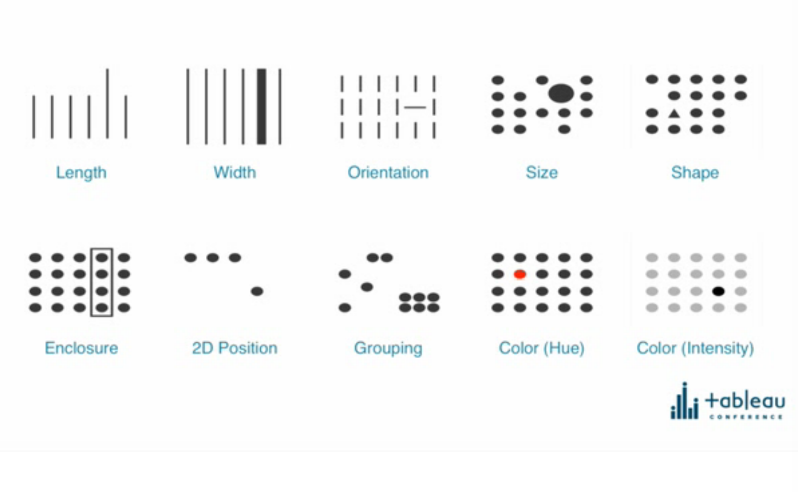

# Data Visualization 101

This repo sets out to achieve a few things:

 - Curate the tidbits of advice about good data visualization over the years
 - Help compare and contrast JS frameworks for the situation of "I just need a graph"
 - Collected my own snippets of boilerplate for data visualisation.

One of the other reasons I am putting this together is that I am working through 
[Interactive Data Visualization for the Web: An Introduction to Designing with D3](https://www.amazon.com.au/Interactive-Data-Visualization-Web-Introduction-ebook/dp/B074JKZ9Z3)
and I like learning by example.

## Dataset

The data set used is the log of odometer readings and dates from everytime I fuelled
up my Nissan Tiida '09 for the entirety of 2017.

## Visual Encoding

This slide was lifted from a key note at Tableau Conference circa 2015.

This image shows the ten most effective ways of visually encoding information as
shown from a research study that flashed up images to candidates. These were
the encodings that were the most effective for the human eye to notice.

_Citation Needed_ 

## Scalable Vector Graphics (SVG)

SVGs are largely the basis for drawing anything on the web and especially when
it is a data driven drawing.

I like the below linked cheat sheet as a reference.

[SVG Cheatsheet](http://www.cheat-sheets.org/own/svg/index.xhtml)

## Resources
 | Book Cover | Title | Published |
 | --- | --- | --- |
 |  | Interactive Data Visualization for the Web: An Introduction to Designing with D3 2nd Edition | Aug 2017 |
  |  | Data Visualisation: A Handbook for Data Driven Design 1st Edition | Jun 2016 |

	| Title | Link |
	| --- | --- |
	| D3 in 5 Days (Email Series) | [https://benclinkinbeard.com/d3in5days/](https://benclinkinbeard.com/d3in5days/) |
