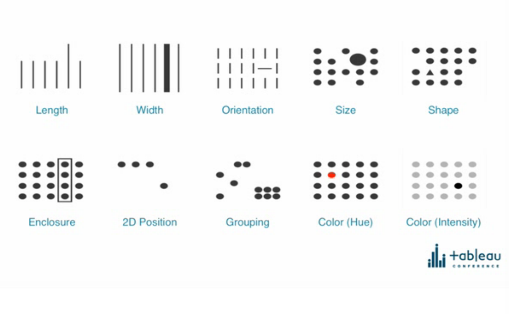
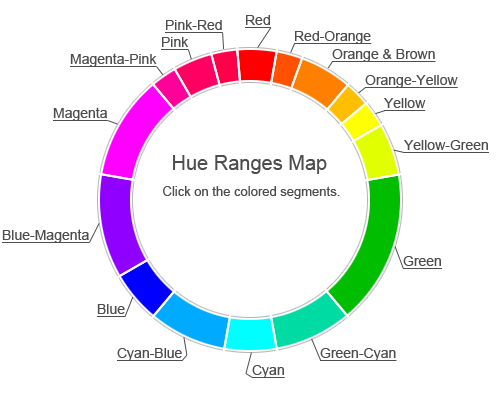

# Data Visualization 101

This repo sets out to achieve a few things:

 - Curate the tidbits of advice about good data visualization over the years
 - Help compare and contrast JS frameworks for the situation of "I just need a graph"
 - Collected my own snippets of boilerplate for data visualisation.
 - Develop a fullstack Typescript server

One of the other reasons I am putting this together is that I am working through 
[Interactive Data Visualization for the Web: An Introduction to Designing with D3](https://www.amazon.com.au/Interactive-Data-Visualization-Web-Introduction-ebook/dp/B074JKZ9Z3)
and I like learning by example.

## Getting Started

```
npm install

# In one terminal run webpack build task which monitors for changes
npm run build:dev

# Run HTTP Server which serves dist/
npm run serve:dev


# Open in a browser http://localhost:3000/
```

## Datasets

`fuel.csv` - The data set used is the log of odometer readings and dates from everytime I fuelled
up my Nissan Tiida '09 for the entirety of 2017.

`NewRun2018` - I competed in the 2018 10k Hill to Harbour and clocked an official 
race time of 54:47 although strava logged it as [53:27](https://www.strava.com/activities/1508899475) since
the course total was 10.2k. 
I scraped all race results and scrubbed competitors names. 
However I am RaceNo 983 and my colleagues were 815 and 1144.


## Visual Encoding



This slide was lifted from a key note at Tableau Conference circa 2015.

This image shows the ten most effective ways of visually encoding information as
shown from a research study that flashed up images to candidates. These were
the encodings that were the most effective for the human eye to notice.

I don't have a citation other than [this blog post by targetprocess](https://www.targetprocess.com/articles/visual-encoding/) which also summarises visual
encodings.

<a href="https://www.targetprocess.com/articles/visual-encoding/">

</a>
<a href="http://www.workwithcolor.com/blue-color-hue-range-01.htm">

</a>


## Mental Bandwidth

[Thinking Fast and Slow](https://www.amazon.com/Thinking-Fast-Slow-Daniel-Kahneman-ebook/dp/B005MJFA2W)
is a book by nobel prize winning experimental psychologist Daniel Kahneman that explains
the concept of mental bandwidth.

He devised an experiment, where people were shown a sequence of four digits. They
had to then on a 60bpm metronome count read out each digit and then wait two beats
and then add 1 (or 3) to each digit on each subsequent beat.

This task demonstrated that around 3-5 pieces of information is the most an average 
person can consume at any given time.

This is important when designing data visualisations to keep the number of pieces
of information to 3-5 before the user interacts, signalling they are ready for more 
information with hover, click or the multitude of touch gestures.

He also goes on to describe the ways in which _psychopathic charm_ are used to
mentally hijack you by using, repeated, empathetic phrases with lots of long words.
It is difficult for you to juggle all those words and distinguish truth.

Similarly, visualisation bypasses the need to interpret words and grammar to 
extract the relationships. Sometimes visualisations are more appropriate as they 
avoid the extra mental effort spoken or written communication requires to digest. 


## Scalable Vector Graphics (SVG)

SVGs are largely the basis for drawing anything on the web and especially when
it is a data driven drawing.

I like the below linked cheat sheet as a reference.

[SVG Cheatsheet](http://www.cheat-sheets.org/own/svg/index.xhtml)

## Mappings and 1000 words

Your data is often abstract and lacking in physical properties.

Yet you are trying to visualise it in a very physical way by drawing it.

Essentially a data visualisation is a _mapping_ between your dataset's _Domain_
and the _Range_ of pixels you need to draw to.

You are mapping properties of your data to any of the visual encoding properties:

 - Length
 - Width
 - Orientation
 - Size
 - Shape
 - Enclosure
 - 2D position
 - Grouping
 - Hue
 - Intensity

Why? Because humans are much better at interpreting visual relationships than
reading text, parsing the grammar of the language and then trying to internally 
visualise that relationship.

And we know what they say a picture is worth...


## Resources

### Typescript

 - https://github.com/bitjson/typescript-starter
 - https://github.com/axilis/typescript-fullstack

### Books

| Book Cover | Title | Published |
| --- | --- | --- |
| <a href="https://www.amazon.com/Visualization-Analysis-Design-AK-Peters-ebook/dp/B00OGLE3XE" alt="Visualization Analysis and Design"></a> | Visualization Analysis and Design | Dec  2014  |
| <a href="https://www.amazon.com.au/Storytelling-Data-Visualization-Business-Professionals-ebook/dp/B016DHQSM2/" alt="Storytelling with Data: A Data Visualization Guide for Business Professionals"></a> | Storytelling with Data: A Data Visualization Guide for Business Professionals | Oct 2015|
| <a href="https://www.amazon.com.au/Interactive-Data-Visualization-Web-Introduction-ebook/dp/B074JKZ9Z3" alt="Interactive Data Visualization for the Web: An Introduction to Designing with D3 2nd Edition, Aug 2017"></a> | Interactive Data Visualization for the Web: An Introduction to Designing with D3 2nd Edition | Aug 2017 |
| <a href="https://www.amazon.com.au/Data-Visualisation-Handbook-Driven-Design-ebook/dp/B01G2C5VCG" alt="Data Visualisation: A Handbook for Data Driven Design 1st Edition"></a> | Data Visualisation: A Handbook for Data Driven Design 1st Edition | Jun 2016 |
| <a href="https://www.amazon.com/Thinking-Fast-Slow-Daniel-Kahneman-ebook/dp/B005MJFA2W" alt="Thinking, Fast and Slow - Daniel Kahneman"></a> | Thinking, Fast and Slow - Daniel Kahneman | Nov 2011|

### Online

| Title | Link |
| --- | --- |
| D3 in 5 Days (Email Series) | [https://benclinkinbeard.com/d3in5days/](https://benclinkinbeard.com/d3in5days/) |
